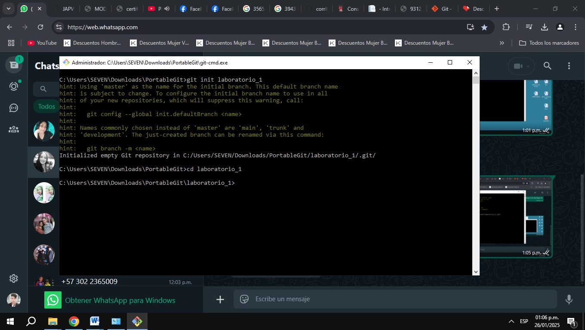
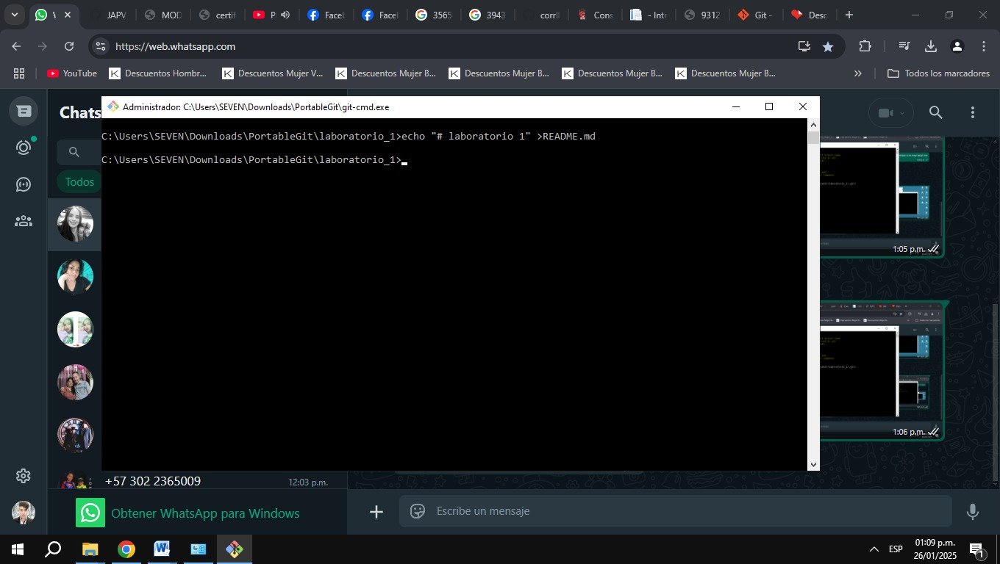
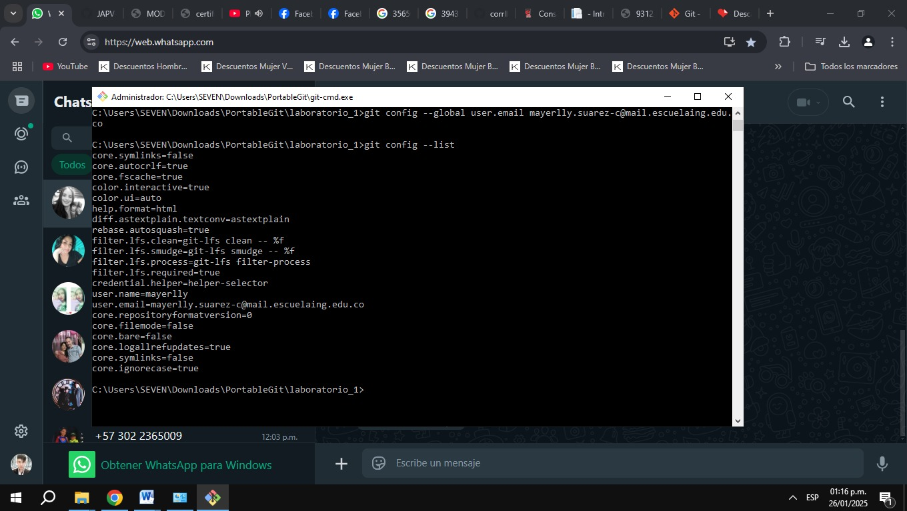
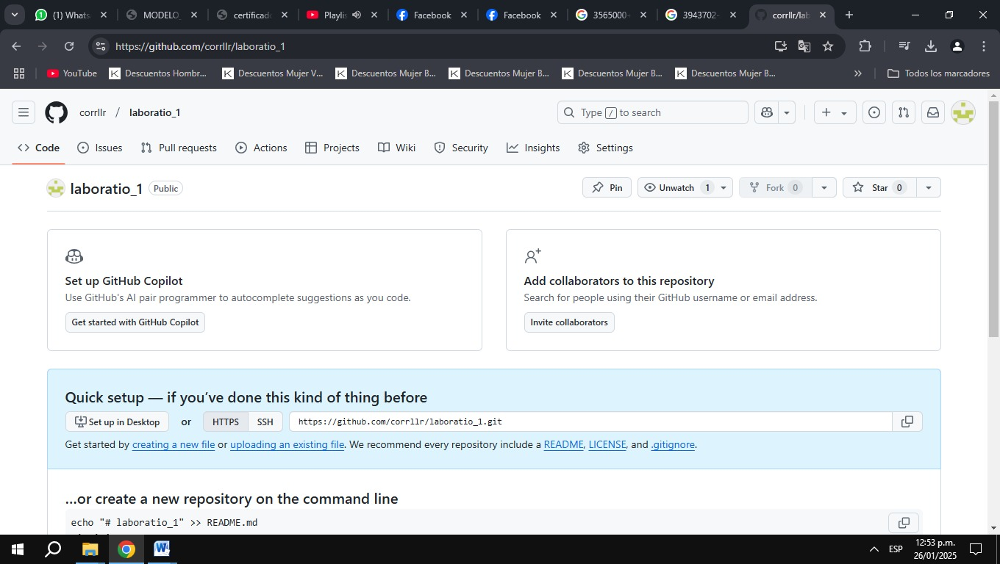
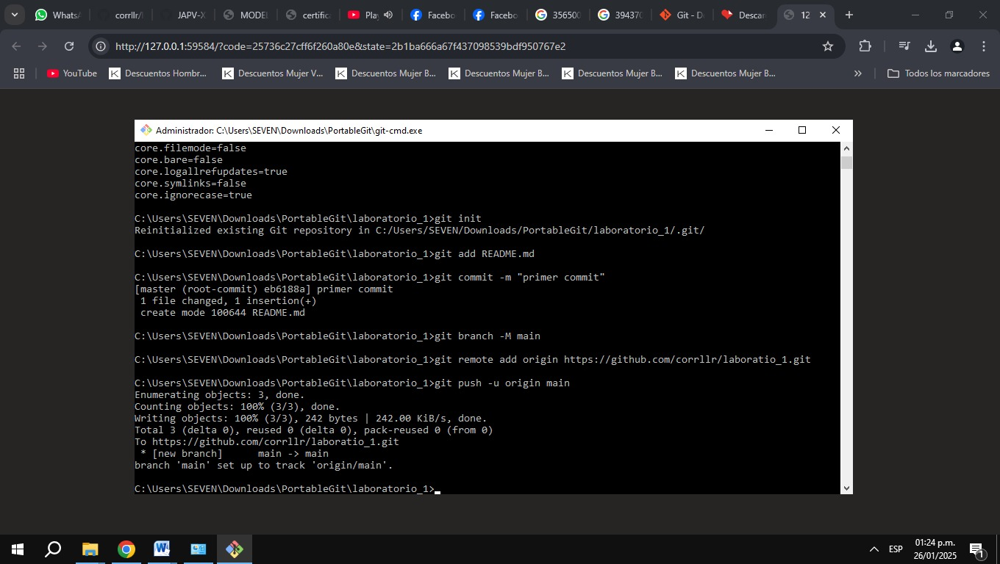
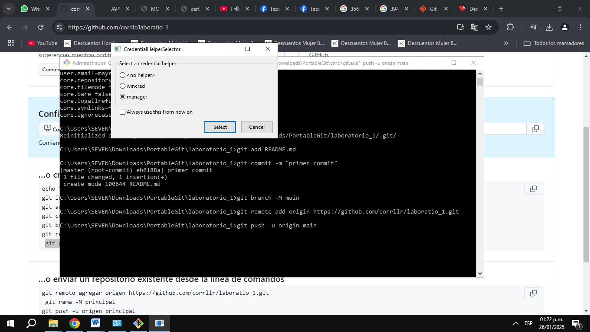

# LABORATORIO 1- INTRODUCCIÓN GIT

## Mayerlly Suárez Correa 
## PARTE I (Trabajo Individual). 
1. **Crear repositorio local**  
   Primero, creamos un repositorio en nuestra máquina local.
   

3. **Agregar archivo README**  
   Luego, agregamos un archivo README dentro del repositorio para proporcionar información sobre el proyecto.
   

5. **Git Add**  
   - Después de realizar los cambios en nuestra área de trabajo, debemos transferir los archivos que queremos confirmar a un área de preparación, conocida como *staging area*.  
   
   **Git Commit**  
   - Una vez que los archivos estén listos en el área de preparación, utilizamos el comando `git commit` para registrar los cambios y crear una confirmación de esos cambios.

6. **Conectar cuenta de GitHub**  
   Conectamos nuestra cuenta de GitHub utilizando el correo institucional para gestionar correctamente los proyectos y contribuciones.
   ```bash
   git config --global user.name Mayerlly
   git config --global user.email mayerlly.suarez-c@mail.escuelaing.edu.co
   git config --list
   ```
   
7. **Crear repositorio en GitHub**  
   Creamos un nuevo repositorio vacío en GitHub.
   
9. **Enlazar repositorio local con remoto**  
   Enlazamos nuestro repositorio local al repositorio remoto que acabamos de crear en GitHub.
   .
    
11. **Subir cambios**  
   Realizamos el proceso de subida de cambios desde nuestro repositorio local hacia el repositorio remoto en GitHub.
   
13. **Configurar correo en Git**  
   Configuramos nuestra dirección de correo electrónico en Git para que las confirmaciones de cambios estén asociadas al correo correcto.
    

10. **Verificar cambios**  
   Finalmente, verificamos que todo esté en orden y funcionando correctamente después de haber subido los cambios al repositorio remoto.

## PARTE II y III

disponible en: https://github.com/JAPV-X2612/my_first_repository/tree/main
    

